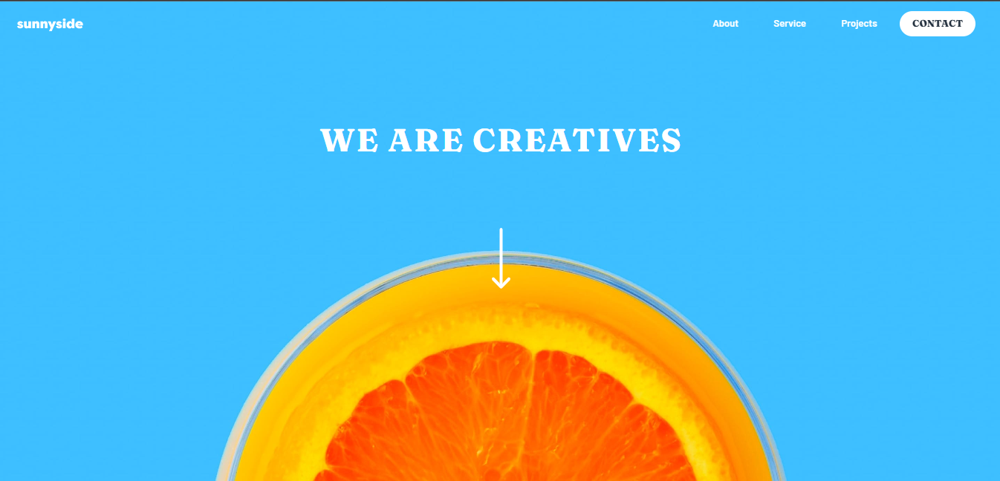

# Frontend Mentor - Sunnyside agency landing page solution

This is a solution to the [Sunnyside agency landing page challenge on Frontend Mentor](https://www.frontendmentor.io/challenges/sunnyside-agency-landing-page-7yVs3B6ef). Frontend Mentor challenges help you improve your coding skills by building realistic projects.

## Overview

Sunnyside agency landing page, a Frontend Mentor challenge.

- This challenge will be a perfect test of layout and responsive skills
- There's a tiny bit of JS for the mobile menu, but the focus is HTML & CSS.

### The challenge

Users should be able to:

- View the optimal layout for the site depending on their device's screen size
- See hover states for all interactive elements on the page

### Screenshot

### Links

- Solution URL: [Solution URL here](https://github.com/ShakhawatNaim/Sunnyside-agency-landing-page.git)
- Live Site URL: [Live site URL here](https://shakhawatnaim.github.io/Sunnyside-agency-landing-page/)

### Built with

- Semantic HTML5 markup
- CSS custom properties
- Flexbox
- CSS Grid
- [Bootstrap](https://getbootstrap.com/) - CSS framework

## Author

- Github - [Shakhawat Naim](https://github.com/ShakhawatNaim)
- Frontend Mentor - [@ShakhawatNaim](https://www.frontendmentor.io/profile/ShakhawatNaim)
- Linkedin - [@shakhawatnaim](https://www.linkedin.com/in/shakhawatnaim/)
